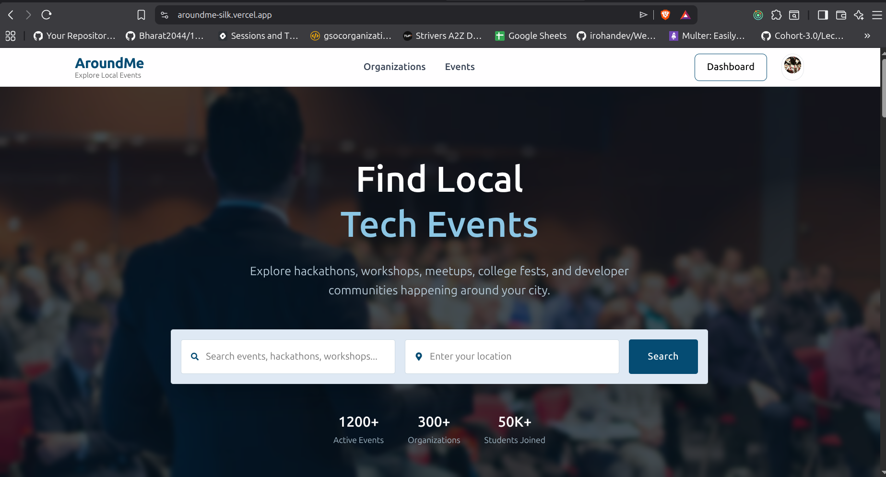
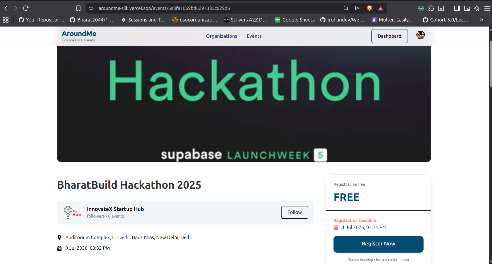
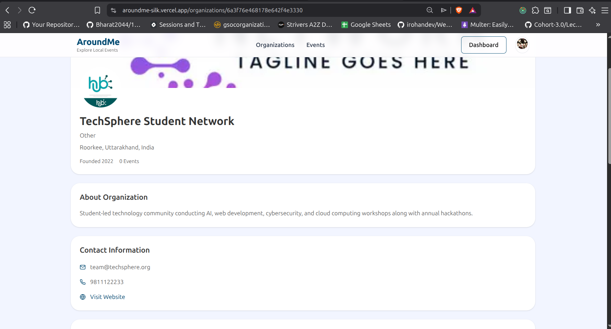
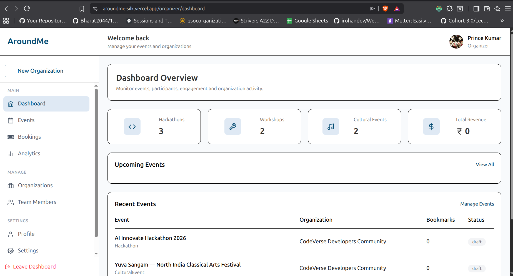

# AroundMe 🌍

> Discover hackathons, workshops, and cultural events happening around you.

## 🌐 Live Demo

**Frontend:** https://aroundme-silk.vercel.app/

---

# 📖 About

AroundMe is a full-stack event discovery platform built using the MERN stack. It helps users discover nearby events such as hackathons, workshops, and cultural programs while allowing registered organizations to publish and manage their own events.

The platform combines location-based event discovery with organization management, event categorization, interactive maps, and a modern responsive interface.

---

# ✨ Features

## 👥 User Features

- Browse all public events
- View detailed event information
- Explore hackathons
- Explore workshops
- Explore cultural events
- Search and discover events
- View event venue on map
- Explore organization profiles
- Responsive experience across devices

---

## 🏢 Organization Features

- Create and manage organizations
- Upload organization logo and cover image
- Edit organization information
- View organization dashboard
- Create events under owned organizations
- Manage published events
- Upload event banners and media
- Update event details
- Delete events

---

## 📍 Location Features

- OpenStreetMap Integration
- Leaflet.js Interactive Maps
- Geocoding using Nominatim
- Venue visualization
- Latitude & Longitude storage
- Address-based location management

---

## 🔐 Authentication & Security

- Clerk Authentication
- Protected Routes
- Role-Based Access Control
- Organization Ownership Validation
- Secure API Access
- Environment Variable Configuration

---

# ⚠️ Important Platform Rule

## Organization First, Event Later

An event cannot exist independently.

Before an organizer can create an event:

1. User logs in.
2. User becomes an owner.
3. Owner creates an organization.
4. Organization becomes available in the owner's dashboard.
5. Owner selects the organization.
6. Owner creates events under that organization.

### Event Ownership Flow

```text
User Login
  ↓
Become Owner
  ↓
Create Organization
  ↓
Organization Created
  ↓
Access Owner Dashboard
  ↓
Create Event
  ↓
Publish Event
```

Without an organization, event creation is not allowed.

This ensures every event is associated with a verified organization and maintains data consistency throughout the platform.

---

# 🎯 Supported Event Categories

## 🚀 Hackathons

Competitive coding, innovation, and technology-focused events.

Examples:

- AI Hackathons
- Web Development Challenges
- Open Source Events
- Startup Innovation Competitions

---

## 🛠 Workshops

Skill-based learning sessions.

Examples:

- React Workshops
- MERN Stack Workshops
- Cloud Computing Workshops
- Cybersecurity Sessions

---

## 🎭 Cultural Events

Community and entertainment activities.

Examples:

- College Fests
- Music Events
- Dance Competitions
- Art Exhibitions

---

# 🖼 Screenshots

## 🏠 Home Page

<p align="center">
  
</p>

## 🎉 Event Detail Page

<p align="center">
  
</p>

## 🏢 Organization Detail Page

<p align="center">
  
</p>

## 📊 Owner Dashboard

<p align="center">
  
</p>

```text

Additional Services:

Clerk → Authentication
Cloudinary → Media Storage
OpenStreetMap → Maps
Nominatim → Geocoding
Vercel → Deployment
```

---

# 🛠 Tech Stack

## Frontend

- React
- Vite
- React Router DOM
- Tailwind CSS
- Axios
- Redux Toolkit
- Clerk
- Leaflet.js
- OpenStreetMap

---

## Backend

- Node.js
- Express.js
- MongoDB
- Mongoose
- Clerk SDK
- Cloudinary
- Multer

---

## Deployment

- Vercel

---

# 📂 Project Structure

```text
AroundMe
│
├── frontend
│   ├── public
│   ├── src
│   │   ├── assets
│   │   ├── components
│   │   ├── pages
│   │   ├── layouts
│   │   ├── routes
│   │   ├── features
│   │   ├── services
│   │   ├── hooks
│   │   ├── utils
│   │   └── App.jsx
│   │
│   └── package.json
│
├── backend
│   ├── controllers
│   ├── routes
│   ├── middleware
│   ├── models
│   ├── services
│   ├── utils
│   ├── config
│   └── server.js
│
└── README.md
```

---

# 🚀 Getting Started

## Clone Repository

```bash
git clone https://github.com/pprince-dhiman/AroundMe.git

cd aroundme
```

---

# Frontend Setup

Create `.env`

```env
VITE_CLERK_PUBLISHABLE_KEY=

VITE_BACKEND_URL=
```

Install dependencies

```bash
npm install
```

Run frontend

```bash
npm run dev
```

---

# Backend Setup

Create `.env`

```env
PORT=

MONGO_URI=

CLERK_WEBHOOK_SECRET=

CLERK_SECRET_KEY=

CLERK_PUBLISHABLE_KEY=

CLOUD_NAME=

CLOUDINARY_API_KEY=

CLOUDINARY_API_SECRET=

FRONTEND_URL=
```

Install dependencies

```bash
npm install
```

Run backend

```bash
npm run dev
```

---

# ☁️ Cloudinary Integration

Cloudinary is used for:

- Organization logos
- Organization cover images
- Event banners
- Event media storage

Benefits:

- Optimized delivery
- CDN support
- Secure uploads
- Scalable storage

---

# 📍 Maps Integration

AroundMe uses:

- OpenStreetMap
- Leaflet.js
- Nominatim Geocoding

### Workflow

```text
Address
   ↓
Nominatim Geocoder
   ↓
Latitude & Longitude
   ↓
MongoDB
   ↓
Leaflet Map Rendering
```

This allows event venues and organization locations to be displayed directly on interactive maps.

---

# 🔄 Event Lifecycle

```text
Draft Event
    ↓
Create Event
    ↓
Upload Media
    ↓
Publish Event
    ↓
Users Discover Event
    ↓
Manage / Update Event
```

---

# 👤 User Roles

## Visitor

- Browse events
- View organizations
- Explore event details

---

## Organization Owner

- Create organizations
- Manage organizations
- Create events
- Edit events
- Delete events
- Upload event media

---

## Admin

- Platform administration
- Content moderation
- User management

---

# 📈 Future Improvements

- Event registration system
- Ticketing support
- Event bookmarks
- Favorites system
- Advanced search filters
- Notifications
- Email reminders
- Event analytics
- Organization verification badges
- Multi-admin organizations
- Reviews and ratings

---

# 🤝 Contributing

Contributions, suggestions, and improvements are welcome.

1. Fork the repository
2. Create a feature branch

```bash
git checkout -b feature/my-feature
```

3. Commit changes

```bash
git commit -m "Add new feature"
```

4. Push changes

```bash
git push origin feature/my-feature
```

5. Open a Pull Request

---

# 👨‍💻 Author

**Prince Kumar**

B.Tech Computer Science Engineering

Built with React, Node.js, Express, MongoDB, Clerk, Cloudinary, OpenStreetMap, and Vercel.

---

## ⭐ Support

If you found this project useful, consider giving it a star on GitHub.

It helps the project grow and motivates future development.
